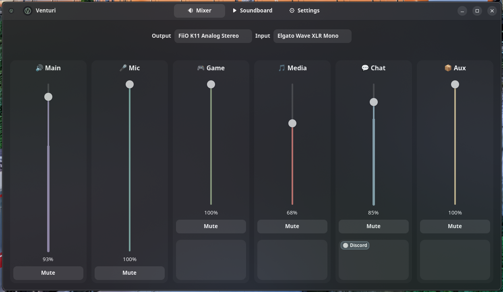

# Venturi

A Linux audio mixer for PipeWire with channel-based routing, virtual devices, and a mixer-first workflow.



## Features

- **Channel-based mixing** — Main, Mic, Game, Media, Chat, and Aux channels with independent volume controls
- **Per-app routing** — Assign applications to channels for fine-grained audio control
- **Virtual devices** — Automatic PipeWire virtual sink/source management
- **Soundboard** — Built-in soundboard for audio playback
- **System tray** — Runs in the background with tray icon support
- **Daemon mode** — Start headless and control via tray

## Install

### From source

Requires Rust (stable) and system libraries for PipeWire, GTK 4, and libadwaita.

**Debian/Ubuntu:**

```bash
sudo apt install libpipewire-0.3-dev libgtk-4-dev libadwaita-1-dev pkg-config clang
```

**Fedora:**

```bash
sudo dnf install pipewire-devel gtk4-devel libadwaita-devel clang
```

**Arch:**

```bash
sudo pacman -S pipewire gtk4 libadwaita clang
```

Then build and run:

```bash
cargo build --release
./target/release/venturi
```

### Flatpak
Install dependencies:
```bash
pip install aiohttp tomlkit
flatpak install flathub org.gnome.Sdk//49
flatpak install flathub org.freedesktop.Sdk.Extension.rust-stable//25.0
```

And download the flatpak-builder script and run to generate cargo-sources.json:
```bash
wget https://raw.githubusercontent.com/flatpak/flatpak-builder-tools/refs/heads/master/cargo/flatpak-cargo-generator.py
python3 flatpak-cargo-generator.py ./Cargo.lock -o flatpak/cargo-sources.json
```

```bash
flatpak-builder --force-clean flatpak-build flatpak/org.venturi.Venturi.json
```

### Debian package (.deb)

```bash
cargo install cargo-deb
cargo deb
sudo dpkg -i target/debian/venturi_*.deb
```

### AppImage

```bash
cargo install cargo-appimage
cargo appimage
```

## Usage

```bash
venturi              # Launch the mixer GUI
venturi --daemon     # Start in daemon mode (tray only, no window)
venturi -v           # Debug logging
venturi -vv          # Trace logging
```

Logging can also be controlled with the `RUST_LOG` environment variable:

```bash
RUST_LOG=venturi=debug venturi
```

## Development

```bash
cargo check          # Type-check without building
cargo test           # Run the test suite
cargo run            # Build and launch
cargo run -- --daemon
```

## Architecture

- Core runtime walkthrough: `docs/architecture/core-runtime.md`

## License

[Mozilla Public License 2.0](LICENSE)
