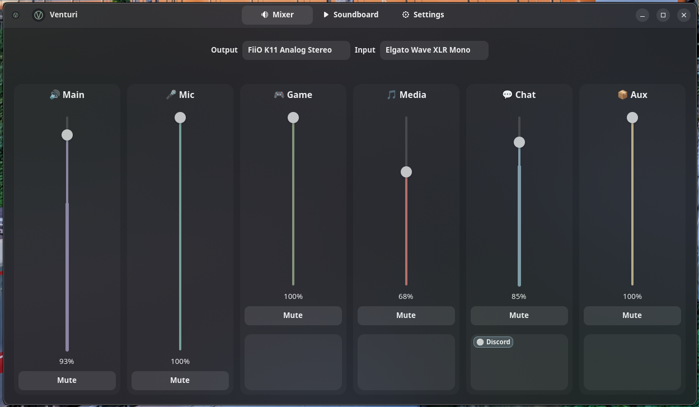

# Venturi

A Linux audio mixer for PipeWire with channel-based routing, virtual devices, and a mixer-first workflow.



## Features

- **Channel-based mixing** — Main, Mic, Game, Media, Chat, and Aux channels with independent volume controls
- **Per-app routing** — Assign applications to channels for fine-grained audio control
- **Virtual devices** — Automatic PipeWire virtual sink/source management
- **Soundboard** — Built-in soundboard for audio playback
- **System tray** — Runs in the background with tray icon support
- **Daemon mode** — Start headless and control via tray

## Install

### mise

Installs the prebuilt binary from the latest GitHub Release. Requires GTK 4
and libadwaita runtime libraries plus PipeWire's CLI tools (`pactl`, `wpctl`,
`pw-link`, `pw-dump`, `pw-record`, `pw-play`, `pw-metadata`).

```toml
[tools]
"ubi:cfbender/venturi" = "latest"
```

`mise upgrade` picks up new releases. (The older
`"cargo:https://github.com/cfbender/venturi"` form builds from git `HEAD`, which
mise treats as a single fixed version, so it never upgrades; use
`mise install --force` if you stay on it.)

### cargo install

Requires Rust (stable) and system libraries for PipeWire, GTK 4, and libadwaita.

**Debian/Ubuntu:**

```bash
sudo apt install libpipewire-0.3-dev libgtk-4-dev libadwaita-1-dev pkg-config clang
```

**Fedora:**

```bash
sudo dnf install pipewire-devel gtk4-devel libadwaita-devel clang
```

**Arch:**

```bash
sudo pacman -S pipewire gtk4 libadwaita clang
```

Then install:

```bash
cargo install --path .
```

### Desktop integration (app launcher + autostart)

After installing with mise or cargo, run the install script to add Venturi to your app launcher and start it on login (in daemon/tray mode):

```bash
./scripts/install-desktop.sh
```

The script auto-detects your binary (mise, cargo, or local build) and writes the absolute path into the desktop entries. To remove:

```bash
./scripts/install-desktop.sh remove
```

### Debian package (.deb)

```bash
cargo install cargo-deb
cargo deb
sudo dpkg -i target/debian/venturi_*.deb
```

### From source

```bash
cargo build --release
./target/release/venturi
```

## Usage

```bash
venturi              # Launch the mixer GUI
venturi --daemon     # Start in daemon mode (tray only, no window)
venturi -v           # Debug logging
venturi -vv          # Trace logging
```

Logging can also be controlled with the `RUST_LOG` environment variable:

```bash
RUST_LOG=venturi=debug venturi
```

## Development

```bash
cargo check          # Type-check without building
cargo test           # Run the test suite
cargo run            # Build and launch
cargo run -- --daemon
```

## Architecture

- Core runtime walkthrough: `docs/architecture/core-runtime.md`

## License

[Mozilla Public License 2.0](LICENSE)
